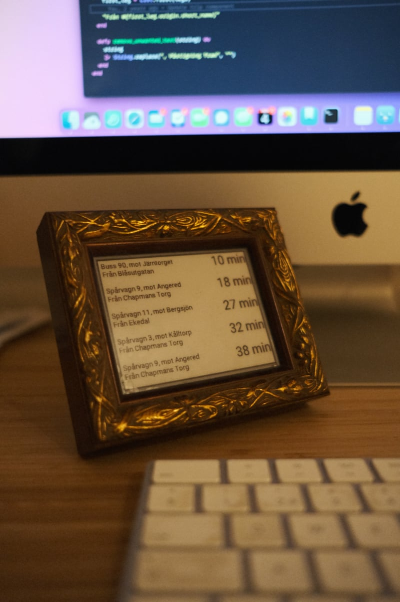

# Restid



An e-ink screen that displays departure time of relevant Västtrafik trips.

## Getting Started

These instructions will get you a copy of the project up and running on your local machine for development and testing purposes.

### Prerequisites

[Install elixir](https://elixir-lang.org/install.html)

[Install Scenic dependencies](https://hexdocs.pm/scenic/install_dependencies.html#on-macos)

[Install Nerves dependencies](https://hexdocs.pm/nerves/installation.html)

### Installing

A step by step series of examples that tell you how to get a development env running

Add api key and secret from [Västtrafik developer portal](https://developer.vasttrafik.se) to `./config/secret.exs`

```bash
cp ./config/secret.example.exs ./config/secret.exs
```

Install dependencies

```bash
export MIX_TARGET=host
mix deps.get
```

Start application in interactive mode

```bash
iex -S mix
```

## Running the tests

Tests can be run with

```bash
mix test
```

## Deployment

This project has only been tested on a Raspberry Pi.

Burn the initial firmware

```bash
# Set the correct target device in the env variable MIX_TARGET
export MIX_TARGET=rpi3a

# Configure the Nerves network connection by setting env variables
export NERVES_NETWORK_SSID="YOUR WIFI SSID NAME"
export NERVES_NETWORK_PSK="YOUR WIFI PASSWORD"

# Fetch the dependencies for the device specified in MIX_TARGET
mix deps.get

# Compile the firmware
mix firmware

# Burn the firmware to a SD card
mix firmware.burn
```

Ensure that Nerves is up and running by pinging it or SSH:ing to it

```bash
ping nerves.local

ssh nerves.local
```

Generate a nerves script to upload updates via the network

```bash
mix firmware.gen.script
```

Compile and push updates via the network

```bash
mix firmware
./upload.sh
```

## Acknowledgments

- [An eInk display with Nerves & Elixir - Getting started with Inky](https://underjord.io/an-eink-display-with-nerves-elixir.html), thank you @lawik for a great resource that got me started with Nerves and Scenic
